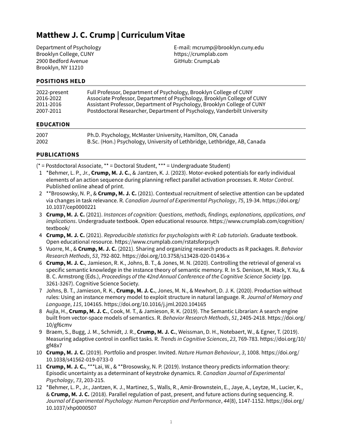
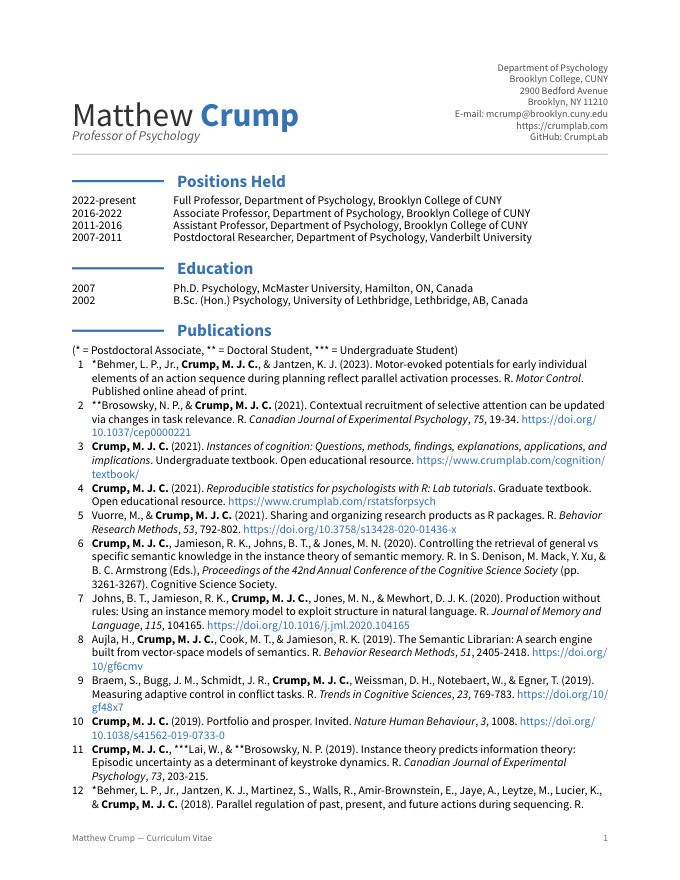
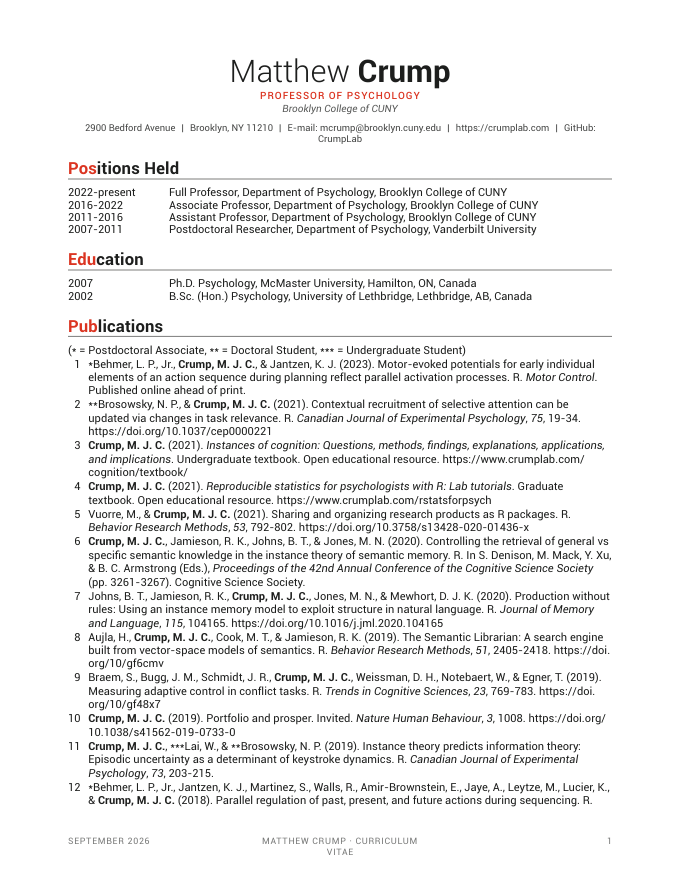

# Styles

Three Typst styles render the same `cv.qmd` and the same data. Page-one previews are in `previews/`
(regenerate with `python3 scripts/render_styles.py --pages 2`; the PDFs land in `_output/cv-<style>.pdf`).

| Style | Preview | Look | Starting point |
|---|---|---|---|
| **classic** (default) |  | Reproduction of the March 2024 formatted CV: bold upper-case section titles with a rule, two-column contact header, left date column, numbered publications with the owner's name in bold and mentee stars. Source Sans Pro stands in for Aptos. | `_extensions/cv-classic` |
| **modern** |  | moderncv "casual": light name with the surname in blue, contact block at the right, a short blue rule in the date column beside each section title, grey dates. Source Sans Pro. | `_extensions/cv-modern` |
| **awesome** |  | Awesome-CV: centred light/bold name, red position line, one-line contact strip, the first three letters of each section title in red, small-caps footer. Roboto. | `_extensions/cv-awesome` |

## How the styles are built

Every style is a Quarto Typst format in `_extensions/cv-<style>/`:

- `typst-template.typ` defines the shared entry functions (`cv-rows`, `cv-numbered`, `cv-bullets`, `cv-table`) that the generated sections call, plus the style's own `cv()` page function (fonts, margins, header, heading rules, footer).
- `typst-show.typ` passes document metadata (name, position, contact lines, date, accent colour) into `cv()`.
- `fonts/` holds the bundled fonts.

Because the entry functions have the same names everywhere, `cv.qmd` and `scripts/build.py` do not know which style is active. Adding a fourth style means copying a folder and changing `cv()`.

## Knobs you can turn without touching Typst

Set these in `cv.qmd` front matter (or `_quarto.yml`) to override a style's defaults:

```yaml
cv-accent: "#3873B3"     # accent colour
cv-font: "Roboto"        # any font Typst can find, bundled or system
cv-fontsize: 10pt
```

Rendering options that change content rather than looks live in `cv-config.yml` (refereed marker, mentee stars, bold name, numbering direction).

## Choosing

The default is set in `_quarto.yml` under `format:` (`cv-classic-typst` today). To switch, change that one key and re-render. The other styles stay available through `scripts/render_styles.py`.

## Decision log

- 2026-09-30: three styles built from the same data; classic set as the default pending the user's pick.
